## Lambda Function to stop an EC2 Instance
### Step 1: Create an IAM Role for Lambda
1. **Create a New IAM Role:**

 * Go to the IAM console.
 * Click on "_Roles_" and then "_Create role_".
 * Choose "_Lambda_" as the trusted entity.
 * Click "_Next: Permissions_".
2. **Attach Permissions:**

* Attach the **_AmazonEC2FullAccess_** policy to the role. This policy allows the Lambda function to manage EC2 instances.
* Optionally, you can create a more restrictive policy if you want to limit permissions.
3. **Name and Create the Role:**

 * Give the role a name, such as _LambdaEC2StopRole_, and create the role.
  
  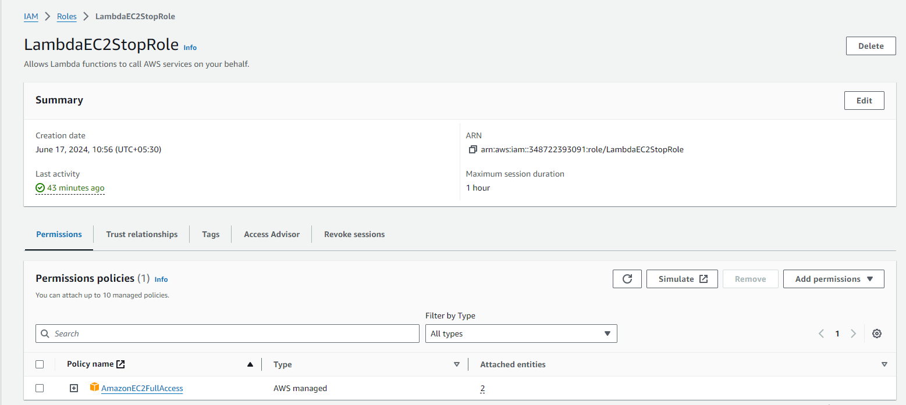

### Step 2: Create the Lambda Function
1. **Create a New Lambda Function:**

 * Go to the Lambda console.
 * Click on "_Create function_".
 * Choose "_Author from scratch_".
 * Enter a name for the function, such as _StopEC2Instance_.
 * Choose _Python 3.x_ as the runtime (or any other runtime you prefer).
 * Under "_Permissions_", choose "_Use an existing role_" and select the IAM role you created earlier (_LambdaEC2StopRole_).
  
  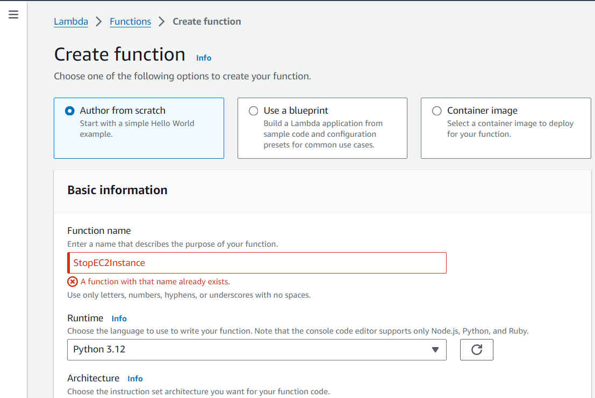
  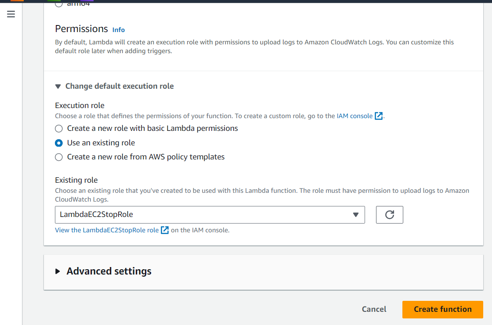
2. **Write the Function Code:**

* In the Lambda function editor, replace the default code with the following Python code:

```python
import json
import boto3

def lambda_handler(event, context):
    ec2 = boto3.client('ec2')
    
    # Instance IDs from the event
    instance_ids = event.get('instance_ids', [])
    
    if not instance_ids:
        return {
            'statusCode': 400,
            'body': json.dumps('No instance IDs provided.')
        }
    
    try:
        # Stop the instances
        response = ec2.stop_instances(InstanceIds=instance_ids)
        
        # Check the response for success
        stopping_instances = response.get('StoppingInstances', [])
        stopped_instances = [inst.get('InstanceId') for inst in stopping_instances]
        return {
            'statusCode': 200,
            'body': json.dumps(f'Instances {stopped_instances} are stopping successfully!')
        }
    except Exception as e:
        return {
            'statusCode': 500,
            'body': json.dumps(f'Error stopping instances: {str(e)}')
        }
```

  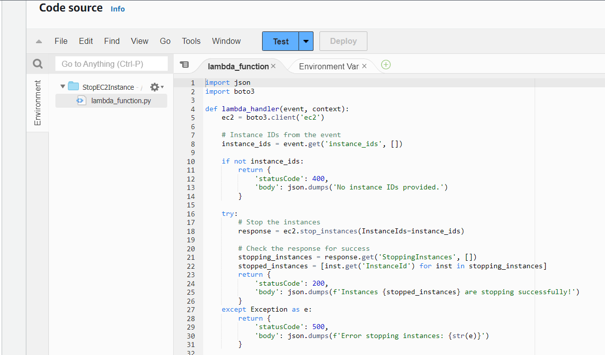

1. **Deploy the Function:**

 * Click "Deploy" to save the changes.
### Step 3: Test the Lambda Function
1. **Create a Test Event:**

 * Click on the "Test" button.
 * Create a new test event with the following JSON structure:

```json
{
  "instance_ids": ["i-xxxxxxxxxxxxxxxxx", "i-yyyyyyyyyyyyyyyyy", "i-zzzzzzzzzzzzzzzzz"]
}
```
* Replace "i-xxxxxxxxxxxxxxxxx" with your actual EC2 instance ID.
* Save the test event with a name like StopInstanceTest.
  
  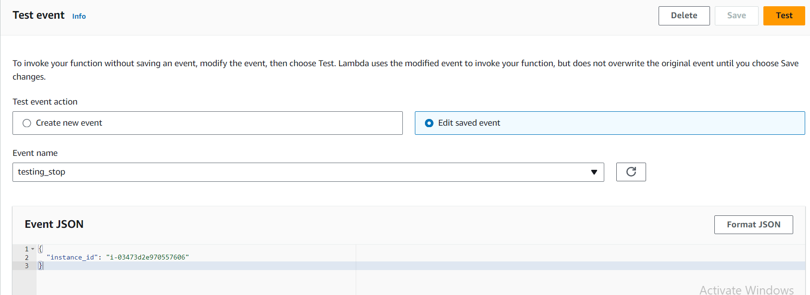

1. **Run the Test:**

* Click "_Test_" to execute the Lambda function.
* Check the EC2 console to confirm that the instance has been stopped.
  
  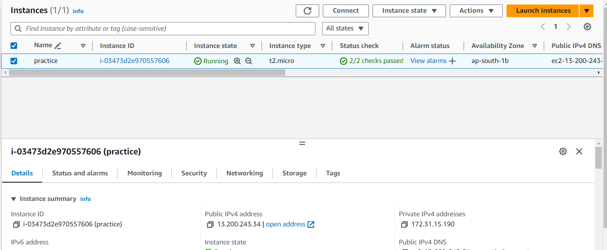
  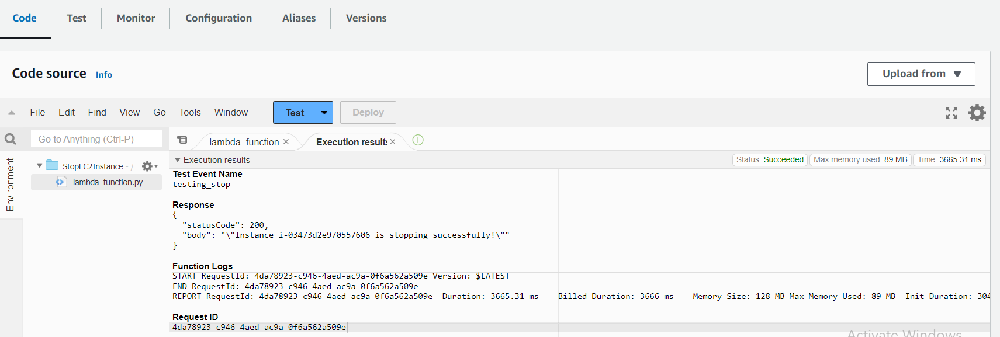
  

### Increasing the Timeout Setting in the AWS Lambda Console
1. **Open the Lambda Function in the AWS Console:**

* Go to the AWS Lambda Console.
* Select your Lambda function (StopEC2Instance).
2. **Modify the Timeout Setting:**

* In the function configuration, locate the "_Basic settings_" section.
* Click the "_Edit_" button (pencil icon).
* Increase the timeout value. Set it to a higher number, such as 30 seconds, to ensure there is enough time for the function to complete.
* Click "Save" to apply the changes.
#### Detailed Steps
1. **Navigate to the Lambda Function Configuration:**

* In the AWS Lambda console, select your function from the list.
2. **Edit Basic Settings:**

* Scroll down to the "_Basic settings_" section.
* Click the "_Edit_" button.
3. **Increase Timeout:**

* Find the "_Timeout_" setting.
* Change the value from the default 3 seconds to a higher value, such as 30 seconds.

4. **Save Changes:**

* Click "Save" to update the function configuration.
  
  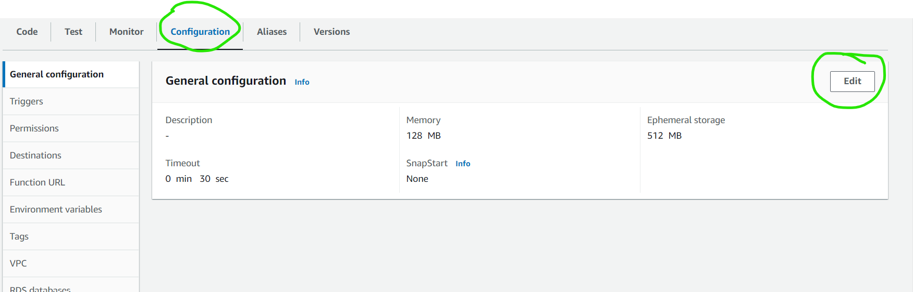
  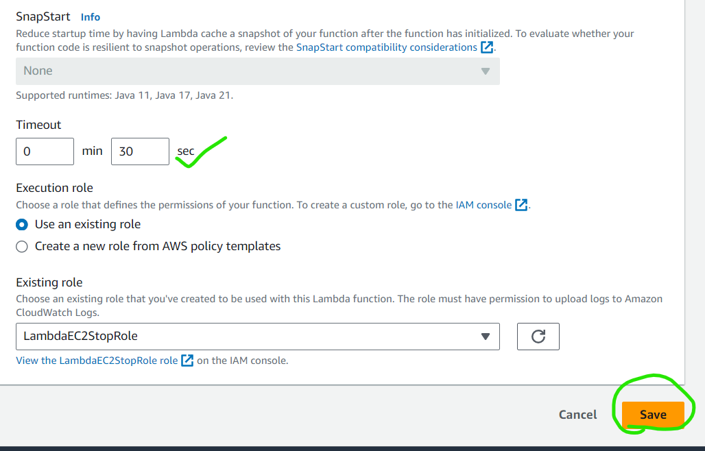

### Step 4: Add Permissions for CloudWatch Events (Optional)
* If you want to trigger this Lambda function on a schedule (e.g., to stop instances at a specific time), you can use CloudWatch Events:

1. **Create a CloudWatch Rule:**
* Go to the CloudWatch console.
* Click on "_Rules_" and then "_Create rule_".
* Choose "_Event Source_" and then "_Schedule_".
* Set the schedule expression (e.g., cron(0 18 ? * MON-FRI *) to stop instances every weekday at 18:00 UTC).
* In "Tar_gets", click "_Add target_" and select "_Lambda function_".
* Choose your Lambda function (_StopEC2Instance_).
* Click "_Configure details_", give the rule a name and description, and create the rule.
  
  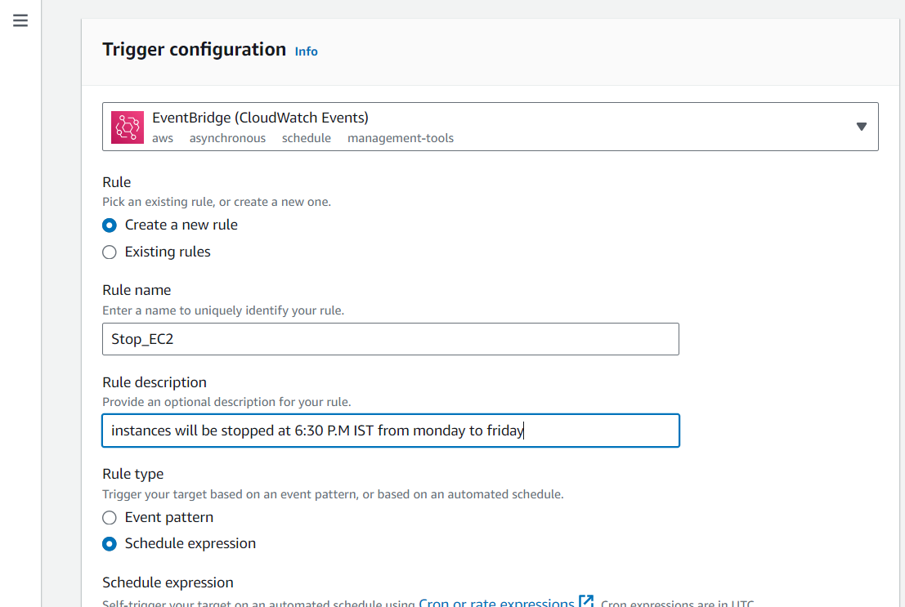
  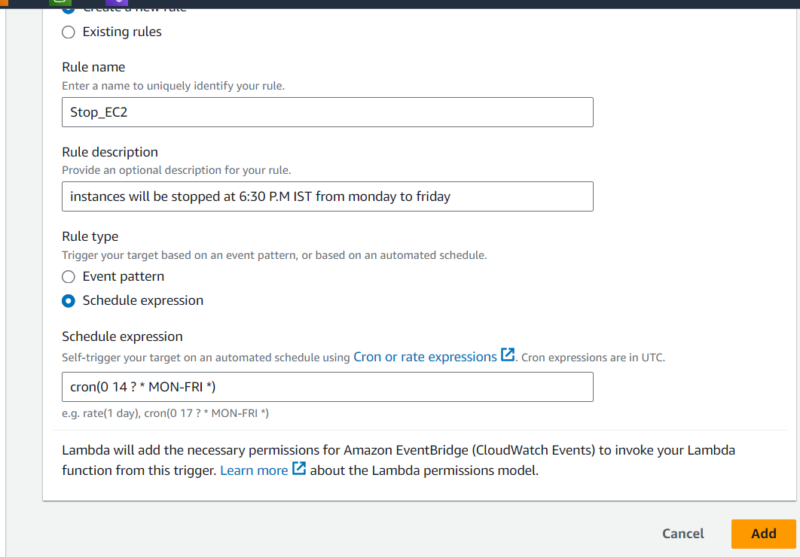
  1[preview](images/lambda13.png)