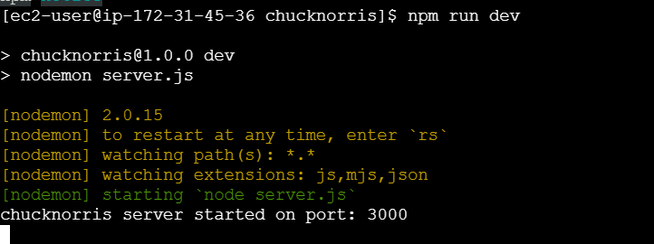
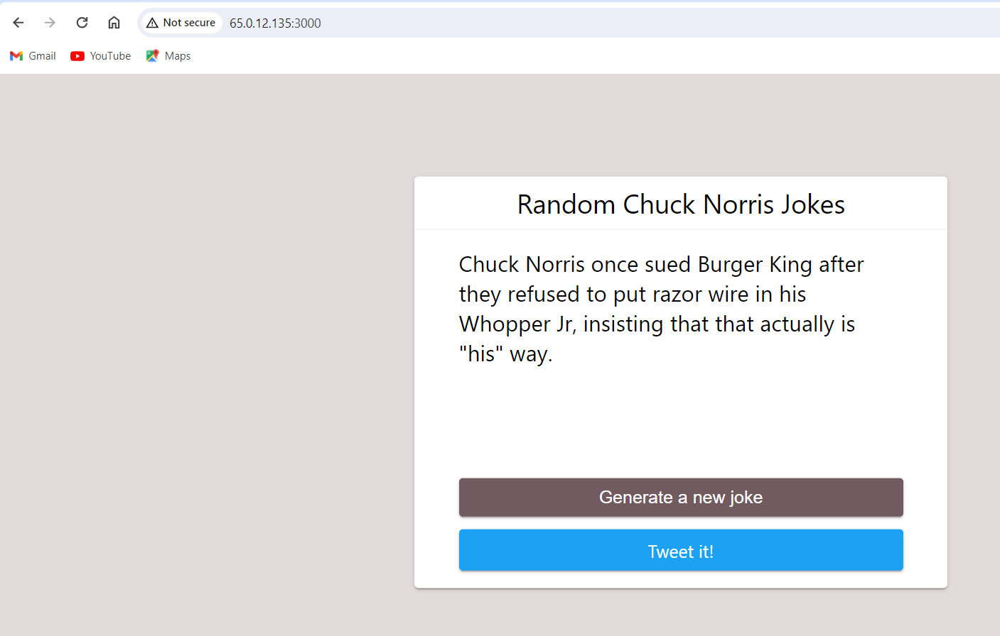
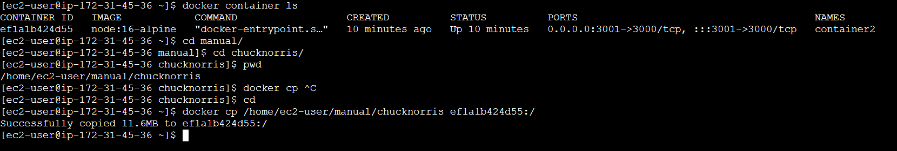
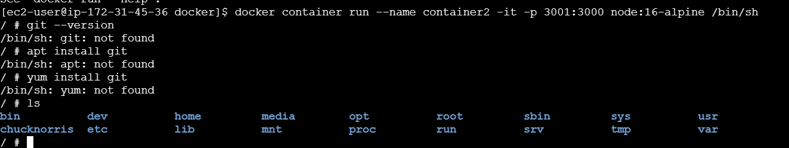
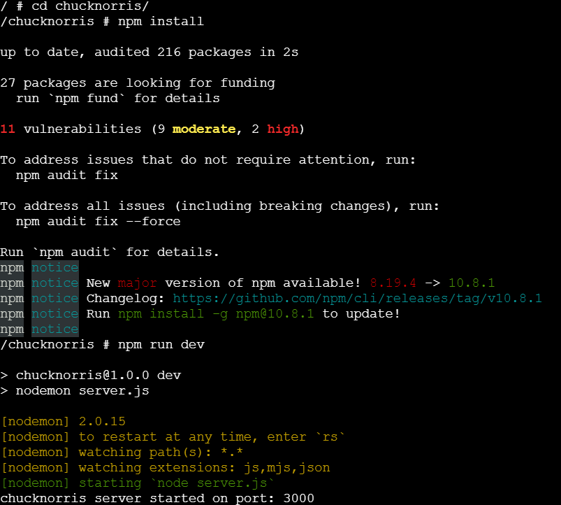
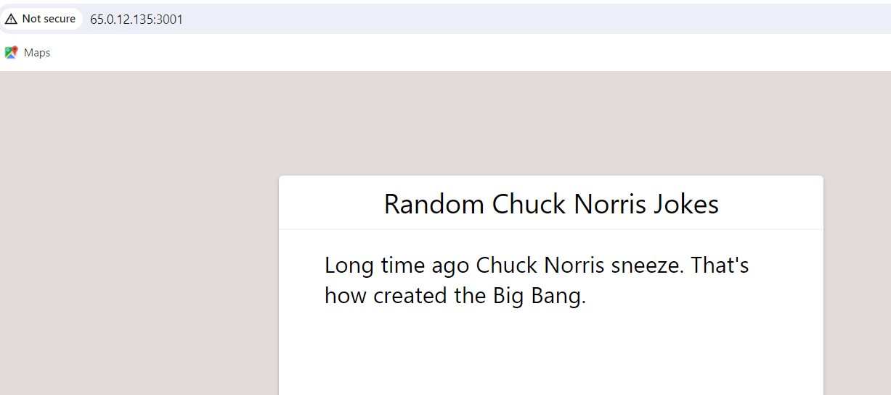
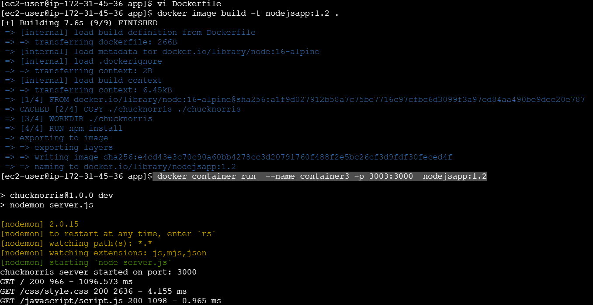

# Docker
* Created a amaxon linux ec2 instance and istalled docker using this [documentation](https://medium.com/@srijaanaparthy/step-by-step-guide-to-install-docker-on-amazon-linux-machine-in-aws-a690bf44b5fe)
* Commands to install docker are
  ```
  sudo yum update -y
  sudo yum install docker -y
  sudo systemctl start docker
  sudo systemctl enable docker
  docker info
  [ec2-user@ip-172-31-45-36 ~]$ docker info
  Client:
   Version:    25.0.3
   Context:    default
   Debug Mode: false
   Plugins:
    buildx: Docker Buildx (Docker Inc.)
       Version:  v0.0.0+unknown
       Path:     /usr/libexec/docker/cli-plugins/docker-buildx

  Server:
  ERROR: Cannot connect to the Docker daemon at unix:///var/run/docker.sock. Is the docker daemon   running?
  errors pretty printing info
  docker --version
  sudo usermod -a -G docker $(whoami)
  newgrp docker
  docker info
  [ec2-user@ip-172-31-45-36 ~]$ docker info
  Client:
  Version:    25.0.3
  Context:    default
  Debug Mode: false
  Plugins:
   buildx: Docker Buildx (Docker Inc.)
     Version:  v0.0.0+unknown
     Path:     /usr/libexec/docker/cli-plugins/docker-buildx
 
  Server:
    Containers: 1
    Running: 0
    Paused: 0
    Stopped: 1
   Images: 1
   Server Version: 25.0.3
   Storage Driver: overlay2
    Backing Filesystem: xfs
    Supports d_type: true
    Using metacopy: false
    Native Overlay Diff: true
    userxattr: false
   Logging Driver: json-file
   Cgroup Driver: systemd
   Cgroup Version: 2
   Plugins:
    Volume: local
    Network: bridge host ipvlan macvlan null overlay
   Log: awslogs fluentd gcplogs gelf journald json-file local splunk syslog
  Swarm: inactive
   Runtimes: runc io.containerd.runc.v2
  Default Runtime: runc
  Init Binary: docker-init
  containerd version: 64b8a811b07ba6288238eefc14d898ee0b5b99ba
  runc version: 4bccb38cc9cf198d52bebf2b3a90cd14e7af8c06
  init version: de40ad0
  Security Options:
    seccomp
    Profile: builtin
   cgroupns
  Kernel Version: 6.1.91-99.172.amzn2023.x86_64
  Operating System: Amazon Linux 2023.4.20240528
   OSType: linux
  Architecture: x86_64
  CPUs: 1
  Total Memory: 949.6MiB
  Name: ip-172-31-45-36.ap-south-1.compute.internal
  ID: 2c93f1c1-0fe8-45a7-8051-e5bbe5f5f2a6
  Docker Root Dir: /var/lib/docker
  Debug Mode: false
  Experimental: false
  Insecure Registries:
   127.0.0.0/8
  Live Restore Enabled: false
  ```
* Taken a sample node js application [refer here](https://medium.com/@sadahamranawake/the-easiest-way-to-install-nodejs-in-amazon-linux-2-2a099b41f743) for instructions to be followed.
### Manual Steps
**Step-1** Install nodejs

     ```
     curl -fsSL https://rpm.nodesource.com/setup_16.x | sudo bash
     sudo yum update
     sudo yum install -y nodejs
     node -v
     npm -v
     ```
**Step-2:** Downloading the sample project
     ```
     git clone https://github.com/betterstack-community/chucknorris
    cd chucknorris
    npm install
    npm run dev
    ```
* Allow 3000 port in security group's inbound rules as the application run on 3000 port.
  
  
### Docker Container
* Create a container and login into that container and do the steps that are required to run our application
* Take the image node:16-alpine
* Command to create a container and navigate into that container`docker container run --name container2 -it -p 3001:3000 node:16-alpine /bin/sh`
* In other tab connect with that instance and copy the code of application to that container `docker cp /home/ec2-user/manual/chucknorris ef1a1b424d55:/`
  
  
  

* Now give commands to run our application
  
  
  

### Dockerfile 
* Created a app directory and clone the code into that directory.
  ```
  mkdir app
  cd app
  git clone https://github.com/betterstack-community/chucknorris
  ```
* Then wrote the Dockerfile.
```Dockerfile
# Use Node 16 alpine as parent image
FROM node:16-alpine
COPY ./chucknorris ./chucknorris
WORKDIR /chucknorris
# Install dependencies
RUN npm install
# Expose application port
EXPOSE 3000
# Start the application
CMD ["npm", "run", "dev"]
```
* Now build the image `docker image build -t nodejsapp:1.2 .`
* To create and run the container ` docker container run  --name container3 -p 3003:3000  nodejsapp:1.2`
  
  
  